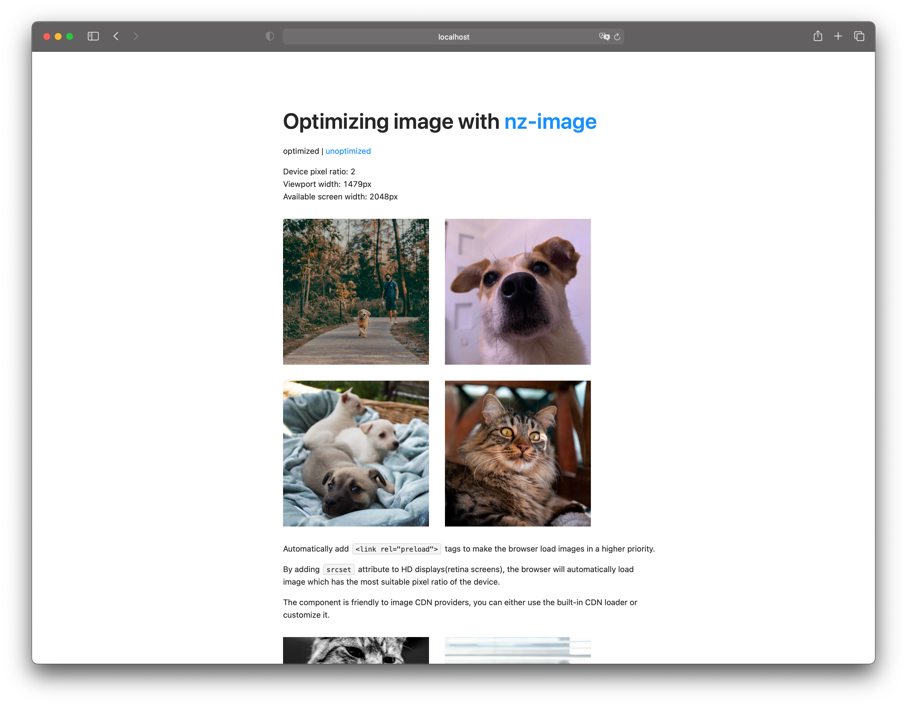

# NzImageExample



## Bundle Sizes

**Unoptimized**

```txt
Initial Chunk Files               | Names         |      Size
styles.4b02c8db79c582338871.css   | styles        | 491.94 kB
main.4aca4d1e2ab8a0f7ee2c.js      | main          | 465.06 kB
polyfills.bf38b4b6f4ab97ebcd21.js | polyfills     |  36.06 kB
runtime.e35c6f0a78b972c3a727.js   | runtime       |   2.28 kB

                                  | Initial Total | 995.34 kB
                                  
Lazy Chunk Files                  | Names         |      Size
4.a80307106e78b9c9e2c8.js         | -             |  40.44 kB

                                  | Total         |   1.05 MB

```

**Optimized**

```txt
Initial Chunk Files               | Names         |      Size
main.16319cabef5945418f2e.js      | main          | 521.81 kB
styles.4b02c8db79c582338871.css   | styles        | 491.94 kB
polyfills.bf38b4b6f4ab97ebcd21.js | polyfills     |  36.06 kB
runtime.a7ad7245ea1e2069a1a7.js   | runtime       |   2.28 kB

                                  | Initial Total |   1.03 MB

Lazy Chunk Files                  | Names         |      Size
4.a72e99c2c63bb438921a.js         | -             |  40.55 kB

                                  | Total         |   1.07 MB
```

**Diff**

```txt
Name          |  Size
Initial Total | + 56.75 kB
Total         | + 56.86 kB
```
